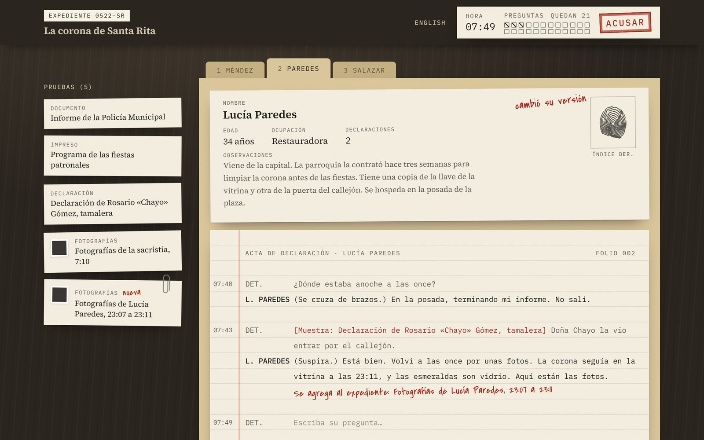

# Interrogatorio

A detective game where the suspects are played by a language model and everything else is not.

A small town in Latin America, the morning of its patron saint's procession. The saint's gold crown is gone from a locked case. You have three people in the rectory and 24 questions before the procession leaves. Question them, put evidence on the table, catch the contradictions, and make a formal accusation backed by proof.

Playable in Spanish and English: **[interrogatorio-five.vercel.app](https://interrogatorio-five.vercel.app)**



## How it works

The model plays characters. It does not run the game.

| Concern | Owner |
| --- | --- |
| What happened, who did it, what counts as proof | The case file, [`src/content/santa-rita.ts`](src/content/santa-rita.ts) |
| Question budget, unlocking evidence, judging the accusation | A pure, deterministic engine, [`src/game/engine.ts`](src/game/engine.ts) |
| Voice, evasion, lies, reluctant admissions | The model |
| Making sure the culprit never confesses in chat | A post-generation guard, [`src/ai/guard.ts`](src/ai/guard.ts) |

A few decisions follow from that split:

- **Need-to-know prompts.** Each suspect's instructions contain only what that person knows. The two innocent suspects never see the solution, so no amount of prompt injection gets it out of them.
- **Evidence is a mechanic.** Showing a specific document to a specific person is what breaks their story. The engine decides when that happens and injects the admission into the character's instructions; the model decides how it sounds.
- **The server trusts nothing but the log.** The client sends the list of turns played so far. The server replays them through the engine to rebuild state, so a forged "I already unlocked this" is rejected.
- **The output is screened in code.** Replies are checked against patterns the culprit must never say and against out-of-character tells ("as an AI…"). A failed draft is regenerated once; if it fails again, the character goes silent, which is in character for anyone in that room.
- **It costs nothing to run.** It uses Groq's free tier. Each visitor gets 30 questions a day so one person can't spend everyone's quota. When the per-minute limit is full the game asks you to wait a minute; when the daily quota runs out, it says the archive is closed for the day.

## Running it

Requires Node 22 or later and a free API key from [console.groq.com](https://console.groq.com/keys).

```sh
npm install
cp .env.example .env.local   # then paste your key into GROQ_API_KEY
npm run dev
```

Open http://localhost:3000.

```sh
npm test        # engine, case data and guard tests
npm run lint
npm run build
```

`npm install` also points git at `.githooks/`, whose pre-commit hook refuses any commit that contains something shaped like an API key.

## Project layout

```
src/
  content/santa-rita.ts   the case: world, suspects, evidence, unlock rules, solution (spoilers)
  game/                   types and the deterministic engine, with tests
  ai/                     prompt building, the model call, the output guard
  app/api/interrogate/    the one API route
  ui/                     the React interface
```

## Stack

Next.js 16, React 19, TypeScript, Tailwind CSS 4, Vercel AI SDK 7 with the Groq provider (`openai/gpt-oss-120b` by default, configurable with `GROQ_MODEL`), Zod, Vitest.

## Spoilers

The solution is in the source. If you want to play first, don't open `src/content/`.
